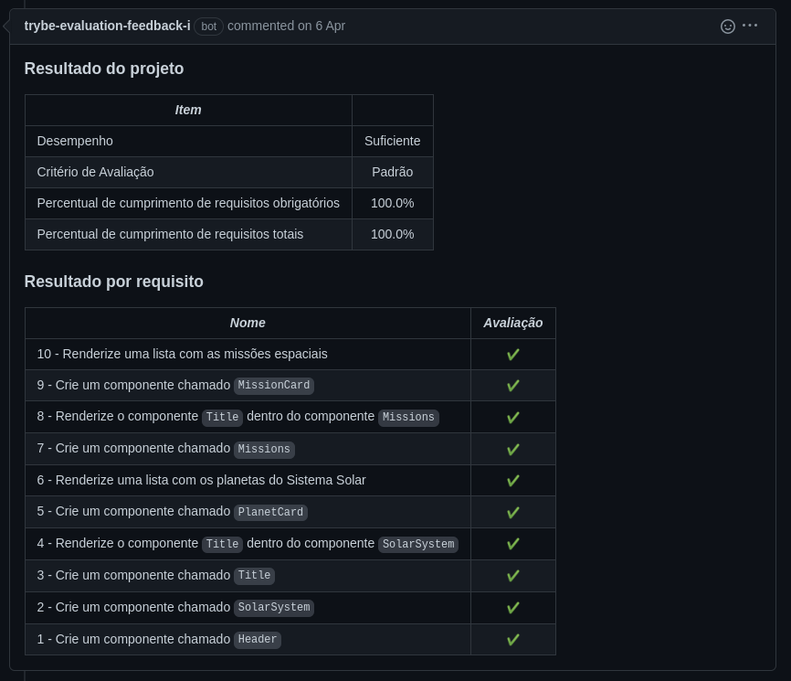
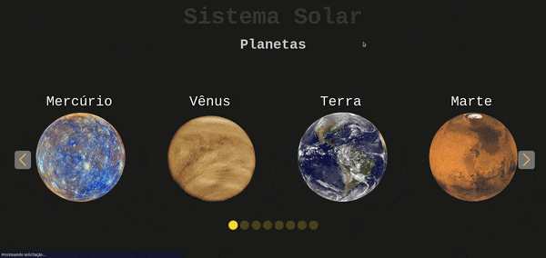

# Português 🇧🇷🇵🇹

<details>
  <summary>
    Saiba mais
  </summary>
  
  # Solar System
Projeto da [Trybe](https://www.betrybe.com/) - Bloco 10 - Aplicação que exibe o Sistema Solar e Viagens Espaciais feito com React.

## 💻 Projeto

<details>
  <summary><strong>🏆 Meu desempenho</strong></summary><br />

  
</details>
  
<details>
  <summary><strong>🖼️ Gif do projeto</strong></summary><br />

  <div>
    
  </div>
  <div>
    
  </div>
</details>

## 🚀 Tecnologias
> Este projeto foi desenvolvido com:

- JavaScript
- React
- CSS

## 📌 Habilidades
> Habilidades desenvolvidas:

- Utilizar JSX no React;
- Criar componentes de classe em React;
- Criar múltiplos componentes a partir de um array;
- Fazer uso de props corretamente e de PropTypes para validá-las;
- Utilizar corretamente o método render() para renderizar os componentes.

## ⬇️ Instalando dependências

```bash
npm install
``` 

## Time de desenvolvimento
> Projeto individual:
  

## 💬 Contatos

<div align="center" style="display: inline_block">
  <a href="https://rabeloguedes.github.io" target="_blank">
    
  </a> 
  <a href="https://www.linkedin.com/in/al%C3%AA-emmanuel-rabelo-guedes/" target="_blank">
    
  </a> 
   <a href="mailto:rabeloguedes@proton.me">
     
  </a>
</div>

</details>

# English 🇺🇸🇬🇧

<details>
  <summary>
    More
  </summary>
  
  # Solar System
Project from [Trybe](https://www.betrybe.com/) - Block 10 - Application that displays the Solar System and Space Travel made with React.

## 💻 Project

<details>
  <summary><strong>🏆 My accomplishment</strong></summary><br />

  
</details>
  
<details>
  <summary><strong>🖼️ Project's Gif</strong></summary><br />

   <div>
    
  </div>
  <div>
    
  </div>
</details>

## 🚀 Technologies
> This project was developed with:

- JavaScript
- React
- CSS

## 📌 Skills
> Practiced skills:

- Use JSX in React;
- Use React to create components;
- Create multiple components from a array;
- Use props correctly and PropTypes to validate them;
- Use render() to render components.

 ## ⬇️ Install dependencies

```bash
npm install
``` 

## Squad
> Single Person Project:
  

## 💬 Contact

<div align="center" style="display: inline_block">
  <a href="https://rabeloguedes.github.io" target="_blank">
    
  </a> 
  <a href="https://www.linkedin.com/in/al%C3%AA-emmanuel-rabelo-guedes/" target="_blank">
    
  </a> 
   <a href="mailto:rabeloguedes@proton.me">
     
  </a>
</div>

</details>

# Deutsch 🇩🇪

<details>
  <summary>
    Mehr
  </summary>
  
  # Solar System
Projekt von [Trybe](https://www.betrybe.com/) - Block 10 - Anwendung, die den Sonnensystem und die Raumfahrt mit React darstellt.
  
## 💻 Projekt

<details>
  <summary><strong>🏆 Meine Leistung</strong></summary><br />
   
</details>
  
<details>
  <summary><strong>🖼️ Projekts Gif</strong></summary><br />
	<div>
    
  </div>
  <div>
    
  </div>
</details>

## 🚀 Technologies
> Dieses Projekt wurde mit den entsprechenden Technologies hergestellt:

- JavaScript
- React
- CSS

## 📌 Fähigkeiten
> Ausgeübte Fähigkeiten:

- JSX in React verwenden;
- Klasse React-Komponenten erstellen;
- Mehrfach-Komponenten aus einem Array erstellen;
- Props korrekt und PropTypes zur Validierung verwenden;
- render() zum Rendern der Komponenten verwenden.

## ⬇️ Installieren dependencies

```bash
npm install
``` 
  
## Entwickungsteam
> Einer Person Projekt:
  

## 💬 Kontakt

<div align="center" style="display: inline_block">
  <a href="https://rabeloguedes.github.io" target="_blank">
    
  </a> 
  <a href="https://www.linkedin.com/in/al%C3%AA-emmanuel-rabelo-guedes/" target="_blank">
    
  </a> 
   <a href="mailto:rabeloguedes@proton.me">
     
  </a>
</div>

</details>
